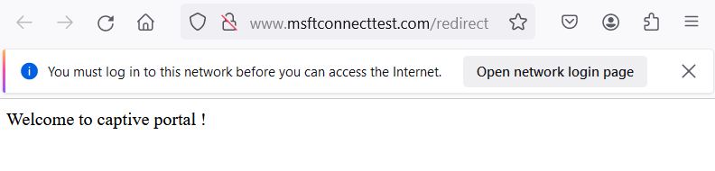
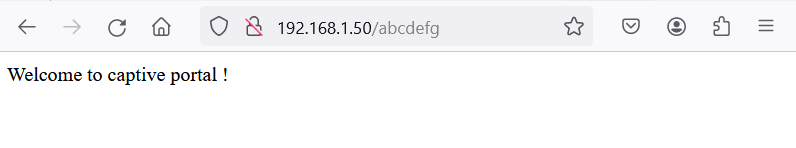

**1) SUMMARY**

This example implements a **captive portal** with library DNSServer, ie web page which opens automatically when user connects Wifi network (eg "PsychitHttp").

Captiveportal is implemented in **ESPAsyncWebServer** [https://github.com/me-no-dev/ESPAsyncWebServer/blob/master/examples/CaptivePortal/CaptivePortal.ino](url) and in **arduino-esp32 examples** [https://github.com/espressif/arduino-esp32/blob/master/libraries/DNSServer/examples/CaptivePortal/CaptivePortal.ino](url)

This feature can be implemented with Psychichttp with a **dedicated handler**, as shown in code below.

Code highlights are added below for reference.

**2) CODE**

**Definitions**
```
// captiveportal
// credits https://github.com/me-no-dev/ESPAsyncWebServer/blob/master/examples/CaptivePortal/CaptivePortal.ino
//https://github.com/espressif/arduino-esp32/blob/master/libraries/DNSServer/examples/CaptivePortal/CaptivePortal.ino
#include <DNSServer.h> 
DNSServer dnsServer;            
class CaptiveRequestHandler : public PsychicWebHandler { // handler 
public:
  CaptiveRequestHandler() {};
  virtual ~CaptiveRequestHandler() {};
  bool canHandle(PsychicRequest*request){
    // ... if needed some tests ... return(false);
    return true;  // activate captive portal
  }
  esp_err_t handleRequest(PsychicRequest *request) {   
   //PsychicFileResponse response(request, LittleFS, "/captiveportal.html"); // uncomment : for captive portal page, if any, eg "captiveportal.html"
   //return response.send();                                                 // uncomment : return captive portal page
   return response->send(200,"text/html","Welcome to captive portal !");     // simple text, comment if captive portal page
  }
};
CaptiveRequestHandler *captivehandler=NULL;             // handler for captive portal
```

**setup()**
```
    // captive portal
    dnsServer.start(53, "*", WiFi.softAPIP());    // DNS requests are executed over port 53 (standard)     
    captivehandler= new CaptiveRequestHandler();  // create captive portal handler, important : after server.on since handlers are triggered on a first created/first trigerred basis
    server.addHandler(captivehandler);            // captive portal handler (last handler)
```

**loop()**
```
  dnsServer.processNextRequest();       // captive portal
```

**3) RESULT**

**Access Point (web page is opened automatically when connecting to PsychicHttp AP)**


**Station (web page is shown whatever url for Station IP, eg 192.168.1.50/abcdefg**



