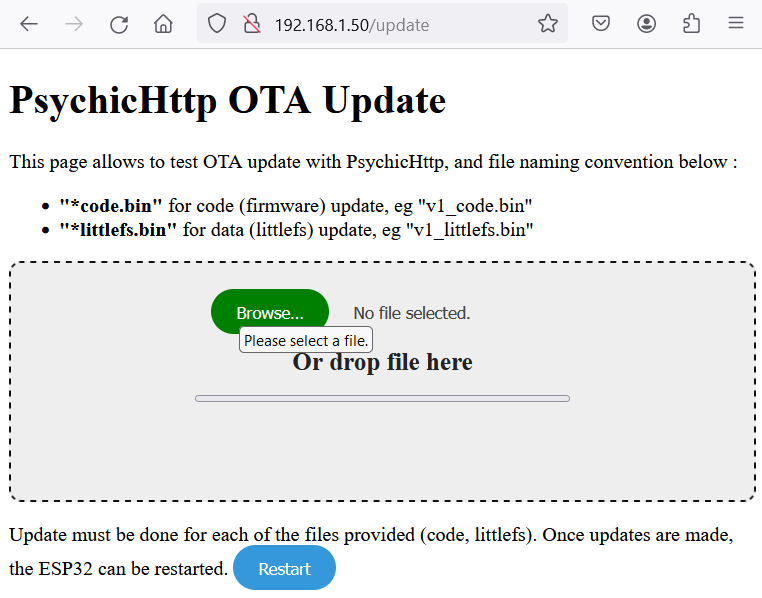
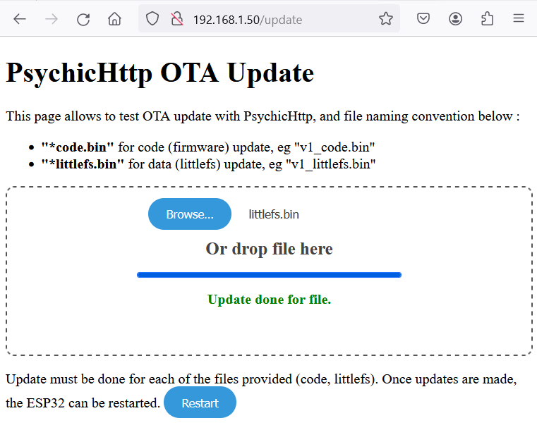
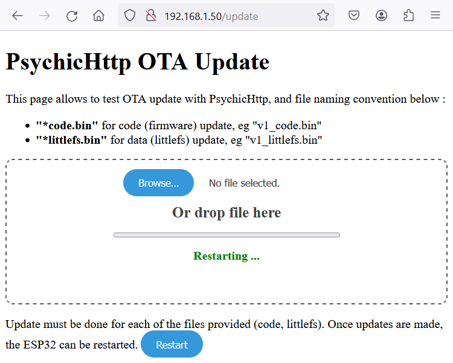

**OTA update example for PsychicHttp**

Example of OTA (Over The Air) update implementation for PsychicHttp, using Arduino IDE.

**Requirements**
Requirements for project are :
- OTA update for code (firmware)
- OTA update for data (littlefs)
- manual restart of ESP32, triggered by User (no automatic restart after code or data file upload)

**Implementation**

OTA update relies on handler PsychicUploadHandler.

Screenshots and Code are shown below.

**Credits**

https://github.com/hoeken/PsychicHttp/blob/master/src/PsychicUploadHandler.cpp

https://github.com/hoeken/PsychicHttp/issues/30 

**Configuration**

Example has been implemented with following configuration :\
Arduino IDE 1.8.19\
arduino-32 v2.0.15\
PsychicHttp 1.1.1\
ESP32S3

**Example Files Structure**

```
arduino_ota
	data
          | update.html
	arduino_ota.ino
	code.bin
	littlefs.bin
	README
```
"code.bin" and "littlefs.bin" are example update files which can be used to update respectily code (firmware) or data (littlefs).

"Real" update files can be generated on Arduino IDE 1.x :
- for code, menu "Sketch -> Export bin"
- for data, using plugin arduino-esp32fs-plugin  https://github.com/lorol/arduino-esp32fs-plugin/releases

**SCREENSHOTS**

**Update code (firmware)**


\
```ESP-ROM:esp32s3-20210327
Build:Mar 27 2021
rst:0x1 (POWERON),boot:0x2b (SPI_FAST_FLASH_BOOT)
SPIWP:0xee
mode:DIO, clock div:1
load:0x3fce3808,len:0x4bc
load:0x403c9700,len:0xbd8
load:0x403cc700,len:0x2a0c
entry 0x403c98d0
[332885][I][PsychicHttpServer.cpp:236] openCallback(): [psychic] New client connected 51
[332895][I][PsychicUploadHandler.cpp:164] _multipartUploadHandler(): [psychic] Remaining size : 867306
[332908][I][PsychicUploadHandler.cpp:164] _multipartUploadHandler(): [psychic] Remaining size : 862016
[332919][I][arduino_ota.ino:128] operator()(): [OTA] updateHandler->onUpload _error 0 Update.hasError() 0 last 0
[332929][I][arduino_ota.ino:133] operator()(): [OTA] update begin, filename code.bin
[333082][I][PsychicUploadHandler.cpp:164] _multipartUploadHandler(): [psychic] Remaining size : 856272
[333095][I][arduino_ota.ino:128] operator()(): [OTA] updateHandler->onUpload _error 0 Update.hasError() 0 last 0
[snip]
[339557][I][PsychicUploadHandler.cpp:164] _multipartUploadHandler(): [psychic] Remaining size : 416
[339566][I][arduino_ota.ino:128] operator()(): [OTA] updateHandler->onUpload _error 0 Update.hasError() 0 last 1
[339718][I][arduino_ota.ino:165] operator()(): [OTA] Update Success: 867072 written
[339726][I][arduino_ota.ino:184] operator()(): [OTA] Update code or data OK Update.errorString() No Error
[339738][I][PsychicHttpServer.cpp:236] openCallback(): [psychic] New client connected 52
[339747][I][PsychicHttpServer.cpp:262] closeCallback(): [psychic] Client disconnected 52

```


**Update data (littlefs)**


```
[ 48216][I][PsychicHttpServer.cpp:236] openCallback(): [psychic] New client connected 51
[ 48226][I][PsychicUploadHandler.cpp:164] _multipartUploadHandler(): [psychic] Remaining size : 1573100
[ 48239][I][PsychicUploadHandler.cpp:164] _multipartUploadHandler(): [psychic] Remaining size : 1567810
[ 48250][I][arduino_ota.ino:128] operator()(): [OTA] updateHandler->onUpload _error 0 Update.hasError() 0 last 0
[ 48261][I][arduino_ota.ino:133] operator()(): [OTA] update begin, filename littlefs.bin
[ 48376][I][PsychicUploadHandler.cpp:164] _multipartUploadHandler(): [psychic] Remaining size : 1562066
[ 48389][I][arduino_ota.ino:128] operator()(): [OTA] updateHandler->onUpload _error 0 Update.hasError() 0 last 0
[ 48408][I][PsychicUploadHandler.cpp:164] _multipartUploadHandler(): [psychic] Remaining size : 1556322
[ 48421][I][PsychicUploadHandler.cpp:164] _multipartUploadHandler(): [psychic] Remaining size : 1550578
[ 48432][I][arduino_ota.ino:128] operator()(): [OTA] updateHandler->onUpload _error 0 Update.hasError() 0 last 0
[snip]
[ 54317][I][PsychicUploadHandler.cpp:164] _multipartUploadHandler(): [psychic] Remaining size : 16930
[ 54327][I][arduino_ota.ino:128] operator()(): [OTA] updateHandler->onUpload _error 0 Update.hasError() 0 last 0
[ 54340][I][PsychicUploadHandler.cpp:164] _multipartUploadHandler(): [psychic] Remaining size : 11186
[ 54351][I][arduino_ota.ino:128] operator()(): [OTA] updateHandler->onUpload _error 0 Update.hasError() 0 last 0
[ 54363][I][PsychicUploadHandler.cpp:164] _multipartUploadHandler(): [psychic] Remaining size : 5442
[ 54375][I][arduino_ota.ino:128] operator()(): [OTA] updateHandler->onUpload _error 0 Update.hasError() 0 last 0
[ 54386][I][arduino_ota.ino:128] operator()(): [OTA] updateHandler->onUpload _error 0 Update.hasError() 0 last 1
[ 54396][I][arduino_ota.ino:165] operator()(): [OTA] Update Success: 1572864 written
[ 54404][I][arduino_ota.ino:184] operator()(): [OTA] Update code or data OK Update.errorString() No Error
[ 54415][I][PsychicHttpServer.cpp:236] openCallback(): [psychic] New client connected 52
[ 54424][I][PsychicHttpServer.cpp:262] closeCallback(): [psychic] Client disconnected 52

```

**Restart**




```
[110318][I][PsychicHttpServer.cpp:236] openCallback(): [psychic] New client connected 51
[110327][I][arduino_ota.ino:205] operator()(): [OTA] <b style='color:green'>Restarting ...</b>
[110338][I][PsychicHttpServer.cpp:236] openCallback(): [psychic] New client connected 52
[111317][W][WiFiGeneric.cpp:1062] _eventCallback(): Reason: 8 - ASSOC_LEAVE
[111319][I][PsychicHttpServer.cpp:262] closeCallback(): [psychic] Client disconnected 51
[111332][I][PsychicHttpServer.cpp:262] closeCallback(): [psychic] Client disconnected 52
ESP-ROM:esp32s3-20210327
Build:Mar 27 2021
rst:0xc (RTC_SW_CPU_RST),boot:0x8 (SPI_FAST_FLASH_BOOT)
Saved PC:0x420984ae
SPIWP:0xee
mode:DIO, clock div:1
load:0x3fce3808,len:0x4bc
load:0x403c9700,len:0xbd8
load:0x403cc700,len:0x2a0c
entry 0x403c98d0
[   283][I][arduino_ota.ino:57] connectToWifi(): [OTA] [WiFi] WiFi is disconnected
[   791][I][arduino_ota.ino:60] connectToWifi(): [OTA] [WiFi] WiFi is connected, IP address 192.168.1.50

```


