# Bluetooth Implementation in ESP-Hosted

**Table of Contents**

- [1. Introduction](#1-introduction)
  - [1.1 Choosing a Bluetooth Host stack](#11-choosing-a-bluetooth-host-stack)
- [2. Bluetooth Controller](#2-bluetooth-controller)
- [3. Bluetooth Interface](#3-bluetooth-interface)
- [4. NimBLE Host Stack](#4-nimble-host-stack)
  - [4.1. Transporting HCI data using Hosted HCI in NimBLE](#41-transporting-hci-data-using-hosted-hci-in-nimble)
    - [4.1.1. Bluetooth Host Hosted HCI Initialization](#411-bluetooth-host-hosted-hci-initialization)
    - [4.1.2. Bluetooth Host Sending Data through Hosted HCI in NimBLE](#412-bluetooth-host-sending-data-through-hosted-hci-in-nimble)
    - [4.1.3. Bluetooth Host Receiving Data from Hosted HCI in NimBLE](#413-bluetooth-host-receiving-data-from-hosted-hci-in-nimble)
  - [4.2. Transporting HCI data using UART](#42-transporting-hci-data-using-uart)
    - [4.2.1. Bluetooth Host HCI Initialization](#421-bluetooth-host-hci-initialization)
    - [4.2.2. Bluetooth Host Sending Data using HCI](#422-bluetooth-host-sending-data-using-hci)
    - [4.2.3. Bluetooth Host Receiving Data using HCI](#423-bluetooth-host-receiving-data-using-hci)
- [5. BlueDroid Host Stack](#5-bluedroid-host-stack)
  - [5.1. Transporting HCI data using Hosted HCI in BlueDroid](#51-transporting-hci-data-using-hosted-hci-in-bluedroid)
    - [5.1.1. Bluetooth Host Hosted HCI Initialization](#511-bluetooth-host-hosted-hci-initialization)
    - [5.1.2. Bluetooth Host Sending Data through Hosted HCI in BlueDroid](#512-bluetooth-host-sending-data-through-hosted-hci-in-bluedroid)
    - [5.1.3. Bluetooth Host Receiving Data from Hosted HCI in BlueDroid](#513-bluetooth-host-receiving-data-from-hosted-hci-in-bluedroid)
  - [5.2. Transporting HCI data using UART](#52-transporting-hci-data-using-uart)
    - [5.2.1. Bluetooth Host HCI Initialization](#521-bluetooth-host-hci-initialization)
    - [5.2.2. Bluetooth Host Sending Data using HCI](#522-bluetooth-host-sending-data-using-hci)
    - [5.2.3. Bluetooth Host Receiving Data using HCI](#523-bluetooth-host-receiving-data-using-hci)
- [6. Configuring the Co-processor for Standard HCI over UART](#6-configuring-the-co-processor-for-standard-hci-over-uart)
- [7. References](#7-references)

## 1. Introduction

ESP-Hosted can transport Bluetooth HCI packets between the Bluetooth
Host on the Hosted Master and the Bluetooth Controller on the Hosted
Co-processor. The Host MCU implement the Bluetooth app and Bluetooth
Host Stack and the co-processor runs the Bluetooth controller and
hardware.

> [!NOTE]
> Check that the memory requirement for your preferred Bluetooth host
> stack can be satisfied on the Host.

> [!WARNING]
> The ESP32 only supports Bluetooth v4.2. If you are using a ESP32 as
> the co-processor, the host Bluetooth stack must also be v4.2.

ESP-Hosted is Bluetooth stack agnostic. To showcase ESP-Hosted's
Bluetooth support, both `esp-nimble` and `esp-bluedroid` are used
here. Users can use their own preferred Bluetooth stack with some
porting effort.

`esp-nimble` is a fork of Apache NimBLE and available from
ESP-IDF. The NimBLE Bluetooth stack provides Bluetooth Low Energy (BLE)
only functionality.

`esp-bluedroid` is a fork of the Bluedroid based stack and available
from ESP-IDF. The BlueDroid stack supports classic Bluetooth as well
as Bluetooth Low Energy.

See [References](#7-references) for links with more information.

### 1.1 Choosing a Bluetooth Host stack

For usecases involving classic Bluetooth as well as Bluetooth Low
Energy, BlueDroid should be used.

For Bluetooth Low Energy-only usecases, using NimBLE is
recommended. It is less demanding in terms of code footprint and
runtime memory, making it suitable for such scenarios.

## 2. Bluetooth Controller

ESP-Hosted uses the Bluetooth controller running on the co-processor.

As ESP-Hosted is just the communication medium, it supports both
Classic BT and BLE controllers. The controller available depends upon
the ESP chipset chosen. As of today, ESP32 supports Classic-BT+BLE,
whereas, the other ESP chipsets support BLE only.

## 3. Bluetooth Interface

Hosted provides two ways to let the Bluetooth stack running on the
Host to communicate with the Bluetooth controller on the co-processor:
Standard HCI and Hosted HCI.

**Standard HCI**

Standard HCI works in dedicated mode. Bluetooth traffic cannot be
multiplexed with other traffic, so a dedicated transport is
needed. Bluetooth HCI frames are transferred over the dedicated
transport.

- standard HCI is a transparent way of handling HCI messages
- HCI messages originating from the Bluetooth stack on the Host are
  sent through an interface (like UART) directly to the Bluetooth
  controller on the co-processor.
- requires extra GPIOs for the standard HCI interface, independent of
  the GPIOs used for the ESP-Hosted interface

Use this option if you want:

- transparency: no extra data added to the HCI messages
- portability: because it is standard HCI, you can replace the
  co-processor with any other co-processor (ESP or otherwise) that has
  a Bluetooth controller

**Hosted HCI**

Hosted HCI is Standard HCI encapsulated for transport over
ESP-Hosted. Bluetooth traffic is multiplexed with other traffic types
on the same transport, each with different Interface types. See the [traffic
types](../README.md#72-interface-types) support by ESP-Hosted message
headers.

- Hosted HCI is standard HCI with extra headers or metadata added
- Hosted HCI embeds the ESP-Hosted header and re-uses the underlying
  ESP-Hosted transport, such as SPI/SDIO
- this option is easier to set up. Once the existing ESP-Hosted
  Transport (SPI or SDIO, for example) has been set up, Bluetooth
  just works

Use this option if you want:

- complete control of Bluetooth messages
- extra flexibility of debugging
- no extra GPIOs (required for Standard HCI)

> [!NOTE]
> If Hosted HCI is configured as the Bluetooth transport, then your
> Bluetooth over Standard HCI configuration must be disabled, and vice
> versa.

## 4. NimBLE Host Stack

The ESP-Hosted Master implements the set of API calls required by the
NimBLE Bluetooth stack to initialize, send and receive Bluetooth data:

- `hci_drv_init`
- `ble_transport_ll_init`
- `ble_transport_to_ll_acl_impl`
- `ble_transport_to_ll_cmd_impl`
- `ble_transport_to_hs_evt`
- `ble_transport_to_hs_acl`

The following sequence diagrams show how to send and receive Bluetooth
on both the Hosted Master and co-processor.

### 4.1. Transporting HCI data using Hosted HCI in NimBLE

#### 4.1.1. Bluetooth Host Hosted HCI Initialization

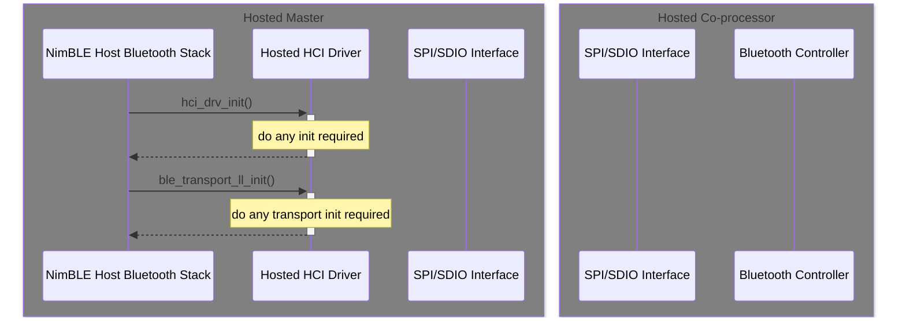

**Bluetooth Host Initialization**

#### 4.1.2. Bluetooth Host Sending Data through Hosted HCI in NimBLE

**Bluetooth Host Sending Data**

#### 4.1.3. Bluetooth Host Receiving Data from Hosted HCI in NimBLE

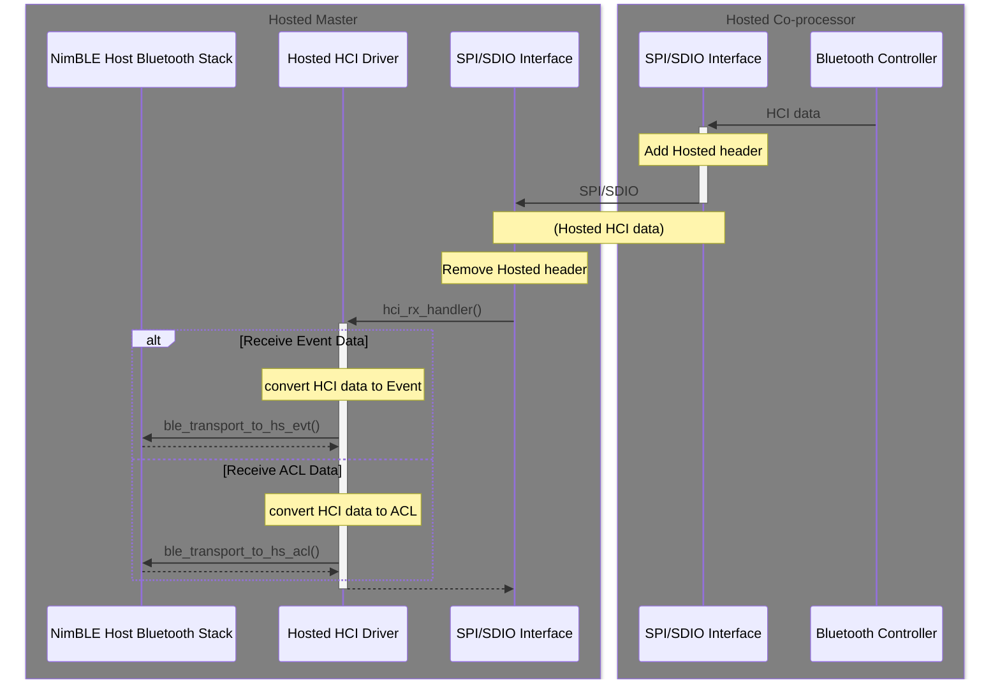

**Bluetooth Host Receiving Data**

### 4.2. Transporting HCI data using UART

#### 4.2.1. Bluetooth Host HCI Initialization

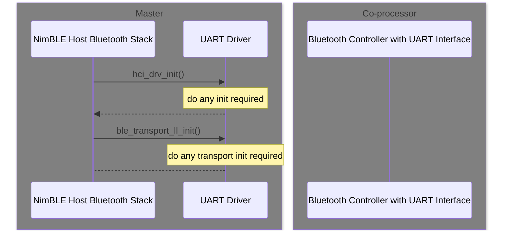

**Bluetooth Host Initialization**

#### 4.2.2. Bluetooth Host Sending Data using HCI

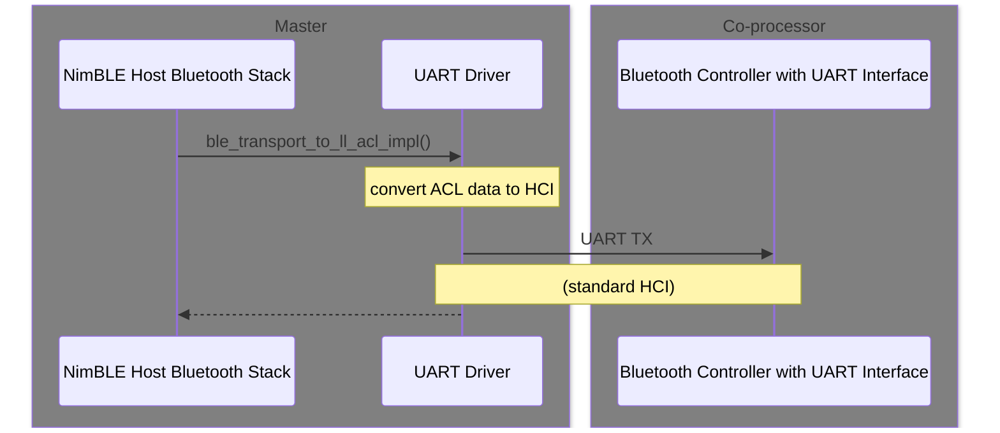

**Bluetooth Host Sending Data**

#### 4.2.3. Bluetooth Host Receiving Data using HCI

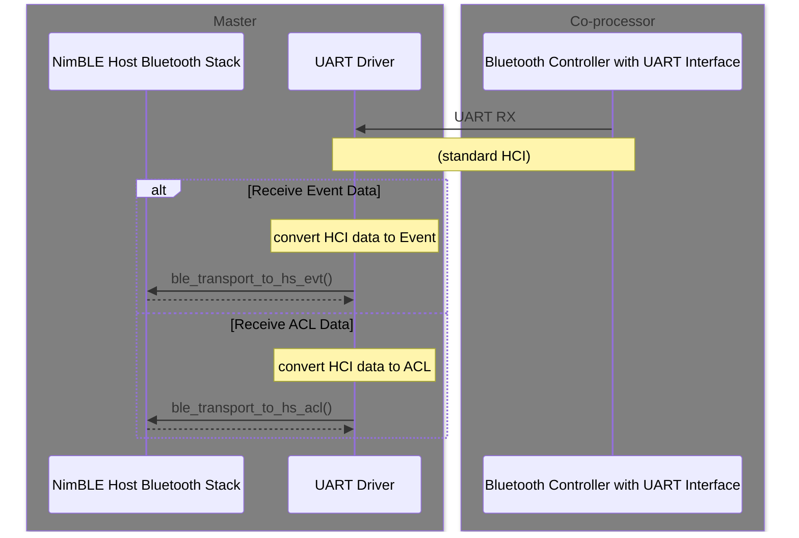

**Bluetooth Host Receiving Data**

## 5. BlueDroid Host Stack

ESP-Hosted implements the set of API calls required by the BlueDroid
Bluetooth stack to initialise, send and receive Bluetooth data.

- `hosted_hci_bluedroid_open`
- `hosted_hci_bluedroid_close`
- `hosted_hci_bluedroid_send`
- `hosted_hci_bluedroid_check_send_available`
- `hosted_hci_bluedroid_register_host_callback`

`hosted_hci_bluedroid_open` must be called by the application before
attaching the transport APIs to BlueDroid and starting BlueDroid. This
initializes the underlying transport.

`hosted_hci_bluedroid_register_host_callback` records the callback
provided by BlueDroid that is use to notify the Bluetooth stack of
incoming HCI data (as `notify_host_recv`).

The following sequence diagrams show how to send and receive Bluetooth
on both the Hosted Master and Co-processor.

### 5.1. Transporting HCI data using Hosted HCI in BlueDroid

#### 5.1.1. Bluetooth Host Hosted HCI Initialization

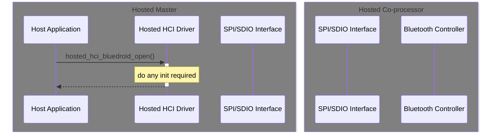

**Bluetooth Host Initialization**

#### 5.1.2. Bluetooth Host Sending Data through Hosted HCI in BlueDroid

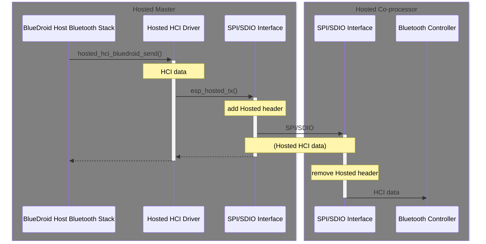

**Bluetooth Host Sending Data**

#### 5.1.3. Bluetooth Host Receiving Data from Hosted HCI in BlueDroid

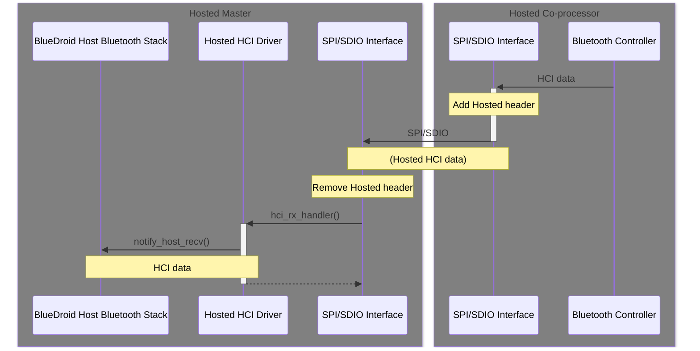

**Bluetooth Host Receiving Data**

### 5.2. Transporting HCI data using UART

When using BlueDroid Host Bluetooth Stack with UART, UART functions
that do the following are required:

- `uart_open` to open the UART driver and initialise the UART (set GPIOs, Baud Rate, etc.)
- `uart_tx` to transmit data over UART
- `UART RX` is a thread that waits for incoming UART data
- `notify_host_recv` is a BlueDroid callback registered with `UART RX` to receive UART data

`uart_open` is called before starting BlueDroid, while `uart_tx` and
`notify_host_recv` are registered by BlueDroid with the UART Driver. See this [ESP-IDF BlueDroid Example using UART](https://github.com/espressif/esp-idf/tree/master/examples/bluetooth/bluedroid/bluedroid_host_only/bluedroid_host_only_uart) for an example implementation.

#### 5.2.1. Bluetooth Host HCI Initialization

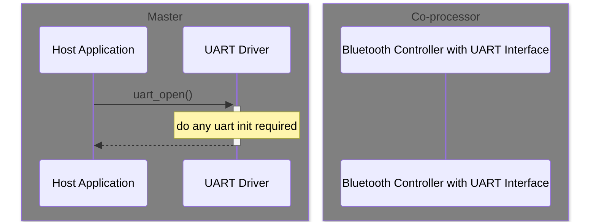

**Bluetooth Host Initialization**

#### 5.2.2. Bluetooth Host Sending Data using HCI

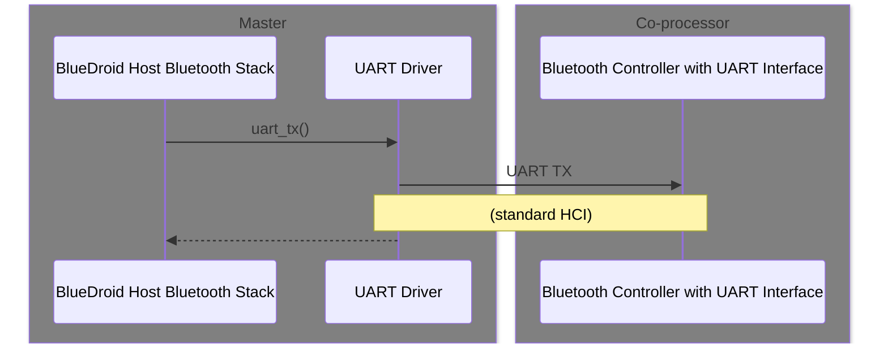

**Bluetooth Host Sending Data**

#### 5.2.3. Bluetooth Host Receiving Data using HCI

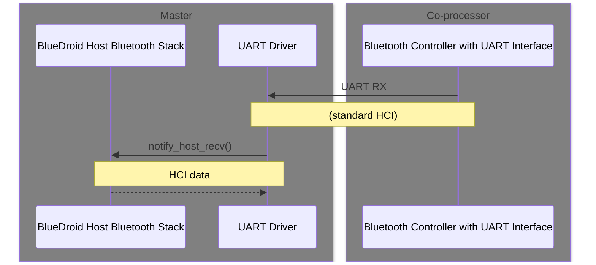

**Bluetooth Host Receiving Data**

## 6. Configuring the Co-processor for Standard HCI over UART

Standard HCI over UART setup is done through the Bluetooth Component
kconfig settings. In menuconfig, select `Component config` ->
`Bluetooth` -> `Controller Options` -> `HCI mode` or `HCI Config` and
set it to `UART(H4)`.

Depending on the selected co-processor, you can configure various UART
parameters (Tx, Rx pins, hardware flow control, RTS, CTS pins,
baudrate) through the Bluetooth Component. Other UART parameters not
handled by the Bluetooth Component are configured by ESP-Hosted
through `Example Configuration` -> `HCI UART Settings`.

> [!NOTE]
> Make sure the Standard HCI UART GPIO pins selected do not conflict
> with the GPIO pins used for the selected ESP-Hosted transport.

## 7. References

- esp-nimble: https://github.com/espressif/esp-nimble
- ESP-IDF NimBLE-based Host APIs: https://docs.espressif.com/projects/esp-idf/en/stable/esp32/api-reference/bluetooth/nimble/index.html
- Bluetooth API: https://docs.espressif.com/projects/esp-idf/en/latest/esp32/api-reference/bluetooth/index.html
- ESP-IDF example using NimBLE on Host to send HCI through UART to co-processor: https://github.com/espressif/esp-idf/tree/master/examples/bluetooth/nimble/bleprph_host_only
- ESP-IDF example using BlueDroid on Host to send HCI through UART to co-processor: https://github.com/espressif/esp-idf/tree/master/examples/bluetooth/bluedroid/bluedroid_host_only/bluedroid_host_only_uart
