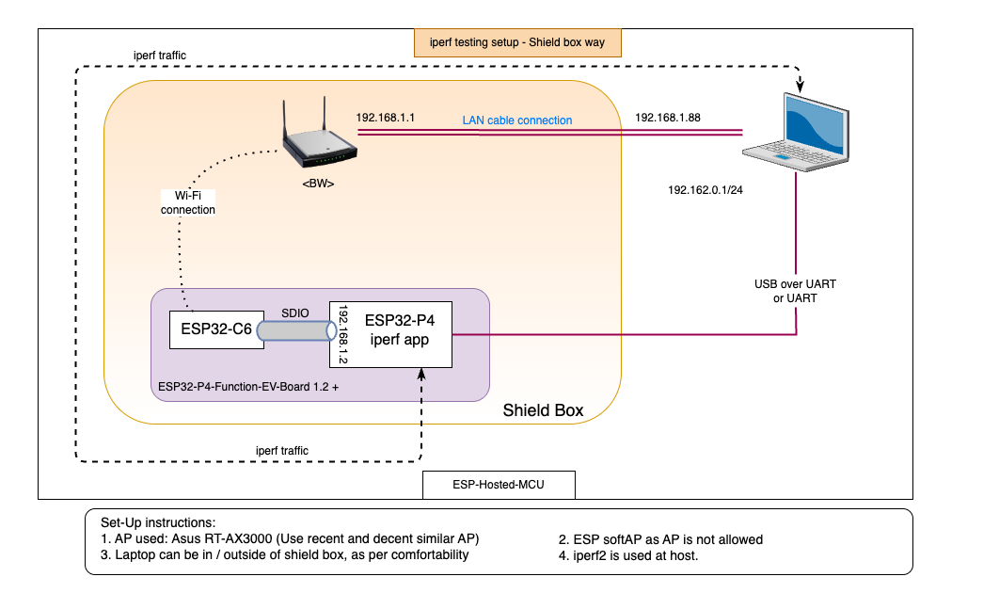

# Shield Box Test Setup for ESP-Hosted

Controlled RF environment for consistent throughput measurements and performance evaluation.

## Overview

**Shield Box Testing** uses RF-shielded enclosure to eliminate external interference and provide repeatable test conditions.

**Key Benefits:**
- Controlled RF environment (no external Wi-Fi/cellular interference)
- Repeatable, consistent results
- Better measurement accuracy vs open air


## Equipment Required

### Essential Components
- **RF Shield Box/Chamber**: Faraday cage enclosure
- **ESP32-P4 Function EV Board**: Host device
- **ESP32-C6/C5 Test Board**: Co-processor device  
- **External PC**: For iPerf client/server
- **Router/Access Point**: Wi-Fi infrastructure
- **Ethernet Connection**: Wired backhaul to PC

Please change the host and co-processor nodes as per current use-case under test.

## Test Setup

### Physical Configuration



### Data Flow
- **PC to MCU Host**:
  ```
  PC -> Router -> ESP Co-processor == SDIO/SPI/UART ==> ESP32-P4
  ```
- **MCU Host to PC**:
  ```
  PC <- Router <- ESP Co-processor <== SDIO/SPI/UART == ESP32-P4
  ```

**Traffic route:**
- PC-to-Router: Ethernet with static IP (eliminates wireless variables)
- Router-to-ESP: Wi-Fi connection (only wireless link in test chain)

## Transport Configurations

### SDIO (Highest Performance)
- **Clock**: 20-50 MHz (start low, optimize up)
- **Bus Width**: 4-bit mode
- **Hardware**: External pull-ups (51kΩ) on CMD, D0-D3

### SPI 
- **Clock**: ESP32: ≤10 MHz, Others: ≤40 MHz
- **Mode**: Full-duplex (simple) or Quad SPI (highest throughput)

### UART
- **Baud Rate**: 921600 (highest stable rate)
- **Use Case**: Low-throughput validation, debugging


## Shield Box vs Open Air

| Aspect | Shield Box | Open Air |
|--------|------------|----------|
| **Repeatability** | High | Variable |
| **Interference** | Eliminated | Present |
| **Debugging** | Easier | Complex |
| **Reality** | Lower | Higher |


---

*For transport setup details: [SDIO](sdio.md) | [SPI Full-Duplex](spi_full_duplex.md) | [SPI Half-Duplex](spi_half_duplex.md) | [UART](uart.md)*