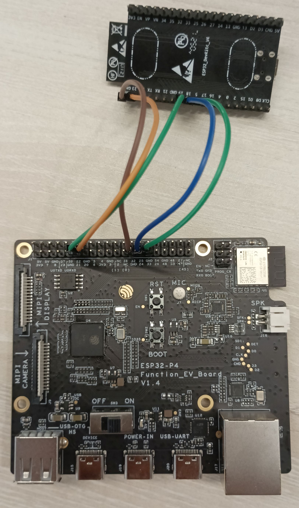

# BLE Peripheral Example Walkthrough

## Introduction

The tutorial is focused on how to implement the custom transport in the application and register it with nimble-host. This example has the exact same working as bleprph except the transport used is custom UART transport written in `"main/uart_driver.c"` file. The controller is disabled for this example, the nimble-host tries to communicate with the external connected controller using UART transport.

Note: This walkthrough only covers the transport used by the application, for detailed explanation see the [bleprph_walkthrough](https://github.com/espressif/esp-idf/blob/master/examples/bluetooth/nimble/bleprph/tutorial/bleprph_walkthrough.md).

## Hardware Setup for Host

This example uses the ESP32-P4 chip to run the `host_nimble_bleprph_host_only_uart_hci` example. The example runs the nimble-host and sends and receives the commands and events using uart. The ESP32 co-procesor runs ESP-Hosted slave, with the BT controller configured to use the UART.

Below is the setup of ESP32-P4 and ESP32.



The ESP32-P4 gpio pins are configurable using `idf.py menuconfig` -> `Example Configuration` -> `Uart Configuration`. The tx pin of one chip connects to the rx pin of the other and vice versa. If you enable `Uart Flow Control`, connect the `CTS` pin on one chip to the `RTS` pin on the other and vice versa.

## Setup for Co-processor

UART HCI setup is done through the Bluetooth Component kconfig
settings. In menuconfig, select `Component config` -> `Bluetooth` ->
`Controller Options` -> `HCI mode` or `HCI Config` and set it to
`UART(H4)`.

Depending on the selected co-processor, you can configure various UART
parameters (Tx, Rx pins, hardware flow control, RTS, CTS pins,
baudrate) through the Bluetooth Component. Other UART parameters not
handled by the Bluetooth Component are configured by ESP-Hosted
through `Example Configuration` -> `HCI UART Settings`.

> [!NOTE]
> Make sure the UART GPIO pins selected do not conflict with the GPIO
> pins used for the selected ESP-Hosted transport.

Co-processor setup for HCI over UART can also be found in the ESP-Hosted Bluetooth Design document on how to [configure the co-processor to use UART for HCI](https://github.com/espressif/esp-hosted-mcu/blob/main/docs/bluetooth_design.md#6-configuring-the-co-processor-for-uart-hci).


## GPIO Setup for Host and Co-processor

Below is the pin connection chart for the ESP32-P4 (as host) and ESP32 (as BT controller).

| ESP32-P4 Signal | ESP32-P4 GPIO Pin | ESP32 Signal | ESP32 GPIO Pin |
|:---------------:|------------------:|:------------:|---------------:|
| Rx  | 33 | Tx  |  5 |
| Tx  | 24 | Rx  | 18 |
| RTS | 20 | CTS | 23 |
| CTS | 21 | RTS | 19 |

## Main Entry Point

The program’s entry point is the app_main() function:

```c
void
app_main(void)
{
    int rc;

    /* Initialize NVS — it is used to store PHY calibration data */
    esp_err_t ret = nvs_flash_init();
    if (ret == ESP_ERR_NVS_NO_FREE_PAGES || ret == ESP_ERR_NVS_NEW_VERSION_FOUND) {
        ESP_ERROR_CHECK(nvs_flash_erase());
        ret = nvs_flash_init();
    }
    ESP_ERROR_CHECK(ret);

    hci_uart_open();
    ret = nimble_port_init();
    if (ret != ESP_OK) {
        ESP_LOGE(tag, "Failed to init nimble %d ", ret);
        return;
    }
    ....
    ....
}
```
In the main function `hci_uart_open()` configures the uart with necessary parameters like baud_rate, parity, etc. The file [uart_driver.c](../main/uart_driver.c) has all the uart transport code along with the necessary apis mandated by nimble-host. `ble_transport_to_ll_acl_impl` is the api used to send the data to the controller. and `ble_transport_to_ll_cmd_impl` is used to send the command to the controller. These two apis are implemented as they are necessary. Along with these two apis, any data that is received in the rx direction is redirected to the host using `ble_transport_to_hs_evt` and `ble_transport_to_hs_acl` apis.

## Conclusion
1. This example covered how to write the custom transport layer and use it with nimble-host.
2. The example used the esp-hosted network-adapter example flashed on esp32c6 connected through UART to test this demo.
3. In the similar fashion the external controller could be connected.
